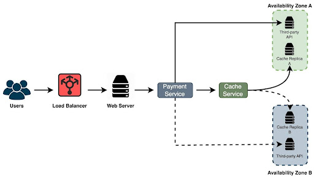

## 1. Introduction (part 2)

### Chaos Engineering in Practice

Let's consider an example to better understand chaos engineering. Imagine we have a system with a load balancer that directs requests to web servers. These servers then connect to a payment service, which, in turn, interacts with a third-party API and a cache service, all located in Availability Zone A. If the payment service fails to communicate with the third-party API or the cache, requests need to be rerouted to Availability Zone B to maintain high availability.

