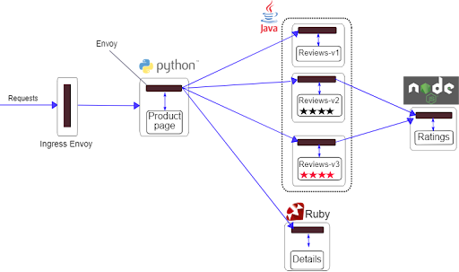

### The Problem
Modern applications often rely on a multitude of interconnected services. While tools like Istio streamline service communication and management, unforeseen failures such as network latency or resource exhaustion can disrupt the entire system. Identifying these potential failure points through Chaos Engineering allows teams to build more resilient systems.

### Application to Deploy
We will deploy the Istio Bookinfo application, a microservices-based demo that showcases Istio's capabilities. This application is ideal for chaos experiments as it involves multiple services interacting with each other, providing ample opportunities to observe the impact of injected faults.
The Bookinfo application is broken into four separate microservices: Which appear in the following figure.

- Product page microservice : calls the details and reviews microservices to populate the page.
- Details microservice: contains book information.
- Reviews microservice: contains book reviews and  calls the ratings microservice.
- Ratings microservice: contains book ranking information that accompanies a book review.

Now let’s see how to deploy Bookinfo of the application step by step:

1. Deploy Bookinfo

    This command applies the configuration specified in the .yaml file to the Kubernetes cluster.

    `kubectl apply -f https://raw.githubusercontent.com/istio/istio/release-1.17/samples/bookinfo/platform/kube/bookinfo.yaml`{{exec}}

2. Check the Status of Pods

    This command displays the status of the pods created by the Bookinfo deployment. You can see whether the pods are running, pending, or facing any issues.

    `kubectl get pods`{{exec}}

    All your pods should be in running state. If it's not the case yet, just wait a few minutes.

3. Expose the Productpage Service Using NodePort

    This command exposes the productpage component of the Bookinfo application to external traffic via a port on the cluster nodes, allowing you to access it from outside the cluster.

    `kubectl expose deployment productpage-v1 --type=NodePort --name=productpage-nodeport`{{exec}}

4. Check the Details of the Exposed Productpage Service

    This command provides details about the productpage-nodeport service, such as its cluster IP, external port, and node port.

    `kubectl get svc productpage-nodeport`{{exec}}

You have now deployed the application. To visualize it: 
1. Go to the hamburger menu in the top right of the page
2. Select the 'Traffic / Ports' option
3. In 'Custom ports', write the port displayed in the result of the previous command
4. Click 'Access'
5. Click 'Test user'
