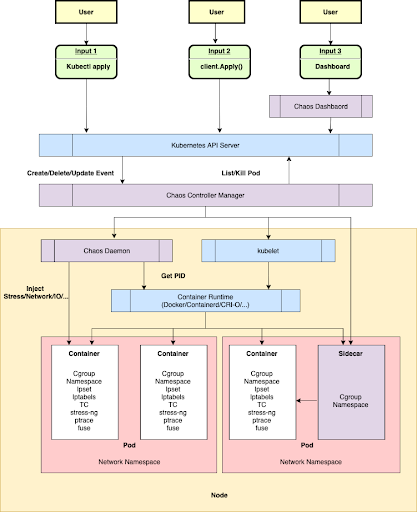

### What is Chaos Mesh?
Chaos Mesh is built on Kubernetes CRD (Custom Resource Definition). To manage different Chaos experiments, Chaos Mesh defines multiple CRD types based on different fault types and implements separate Controllers for different CRD objects. Chaos Mesh primarily contains three components:
- Chaos Dashboard: A user-friendly web interface for managing and monitoring Chaos experiments. It also includes role-based access control (RBAC) for permission management.
- Chaos Controller Manager: The core component responsible for scheduling and managing Chaos experiments. It includes various CRD controllers, such as Workflow and Scheduler Controllers, for handling different types of faults.
- Chaos Daemon: The execution component running in DaemonSet mode, with privileged access (modifiable). It manipulates network devices, file systems, and kernels by interacting with the target Pod Namespace.

The following figure describes the architecture of Chaos Mesh:

### Install Chaos Mesh
1. Add Chaos Mesh Helm repository

    This command adds the Chaos Mesh Helm chart repository to your local Helm client.

    `helm repo add chaos-mesh https://charts.chaos-mesh.org`{{exec}}

    Helm can now access and install Chaos Mesh charts from the specified repository.

2. Create a Dedicated Namespace for Chaos Testing

    This command establishes a separate namespace in Kubernetes for deploying Chaos Mesh components.

    `kubectl create namespace chaos-testing`{{exec}}

    A logical separation is created, isolating Chaos Mesh resources from other applications.

3. Install Chaos Mesh using Helm

    Deploys Chaos Mesh into the Kubernetes cluster using Helm with specific configurations. 

    `helm install chaos-mesh chaos-mesh/chaos-mesh --namespace=chaos-testing --set dashboard.create=true --set chaosDaemon.runtime=containerd --set chaosDaemon.socketPath=/run/containerd/containerd.sock --version 2.7.0`{{exec}}

    Chaos Mesh components, including the Dashboard, Controller Manager, and Daemon, are deployed in the chaos-testing namespace with the specified settings.

4. Verify the Deployment of Chaos Mesh Pods

    Lists the status of all the Chaos Mesh Pods in the chaos-testing namespace to verify that are up and running.

    `kubectl get pods -n chaos-testing`{{exec}}

    All your pods should be in running state. If it's not the case yet, just wait a few minutes.
